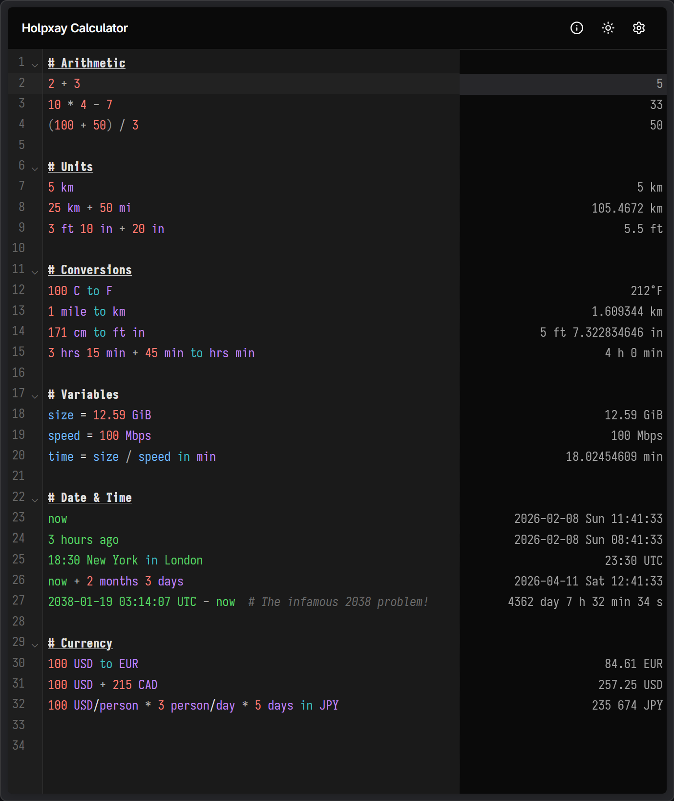

# Holpxay Calculator

A notepad calculator where math just works. Type expressions, see results instantly.

> **holpxay** &nbsp; *n.* [hol.ˈp'aj] number.



[Try Holpxay Calculator](https://calc.1a23.studio/)

## Features

**Arithmetic & Numbers**
- Basic math with `+`, `-`, `*`, `/`, `^`, `!`, `mod`, and parentheses
- Alternative operators: `×`, `·`, `÷`
- Percentages (`50%`, `200 * 15%`), scientific notation, underscore separators
- Hex (`0xFF`), binary (`0b1010`), octal (`0o777`), arbitrary bases (`ABC base 16`)
- Built-in constants (`pi`, `e`, `phi`) and functions (`sin`, `cos`, `sqrt`, `log`, `round`, `abs`, `random`, ...)

**Units & Conversions**
- 200+ built-in units across length, mass, time, temperature, data, energy, power, pressure, frequency, angle, and more
- Automatic cross-unit arithmetic: `5 km + 500 m`, `100 ft^2 + 5 m^2`
- Derived units: `60 km/h`, `9.8 m/s^2`, `50 watts per square meter`
- Composite values: `5 ft 7 in`, `2 hr 30 min 15 sec`
- Flexible conversion syntax: `to`, `in`, `as`, `->`, `→`
- Composite conversion targets: `171 cm to ft in`
- User-defined units: `150 apples / 30 apples/day`

**Date & Time**
- Date literals, relative dates (`today`, `3 days ago`, `2 weeks from now`)
- Time values in 12h/24h format
- Date arithmetic: `now + 100 days`, `2038 Jan 19 - today`
- Timezone conversions: `18:30 Tokyo`, `now in London`, UTC offsets
- Unix timestamps: `1700000000 unix`
- Property extraction: `today to weekday`, `now to hour`

**Currency**
- ISO codes, symbols, and names with live exchange rates
- Arithmetic and conversion: `100 USD + 50 EUR`, `100 USD to JPY`
- Derived currency units: `150 USD/person * 4 person`

**Variables & Conditionals**
- Variable assignment: `price = 49.99`
- Boolean expressions: comparisons, `&&`, `||`, `!`
- Conditionals: `if 5 > 3 then 100 else 200`
- Bitwise operations: `&`, `|`, `xor`, `~`, `<<`, `>>`

**Output Formats**
- Number bases (`to hex`, `to binary`), fractions, scientific notation, percentages, ordinals
- Precision control: `pi to 2 decimals`, `12345 to 3 sig figs`
- Date/time formats: ISO 8601, RFC 2822, RFC 9557, unix timestamps

**Editor**
- Markdown headings and inline comments (`#`)
- GFM syntax highlighting alongside live calculations
- Customizable themes, fonts, number/date formatting, and more

## Getting Started

```bash
npm install
npm run dev       # start dev server
npm run build     # typecheck + production build
npm test          # run tests
```

## Tech Stack

React 19, TypeScript, Vite, Tailwind CSS 4, CodeMirror 6, Nearley, moo, Temporal API polyfill, shadcn/ui

## License

```
Holpxay Calculator - A notepad calculator.
Copyright (C) 2026  Eana Hufwe <https://1a23.com/>

This program is free software: you can redistribute it and/or modify
it under the terms of the GNU Affero General Public License as published by
the Free Software Foundation, either version 3 of the License, or
(at your option) any later version.

This program is distributed in the hope that it will be useful,
but WITHOUT ANY WARRANTY; without even the implied warranty of
MERCHANTABILITY or FITNESS FOR A PARTICULAR PURPOSE.  See the
GNU Affero General Public License for more details.

You should have received a copy of the GNU Affero General Public License
along with this program.  If not, see <http://www.gnu.org/licenses/>.
```
